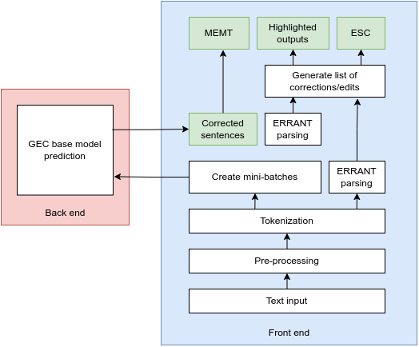

<!--Grammatical Error Correction Using Machine Learning Web Application-->

# Introduction

## Motivation

English is one of the most widely used languages globally, serving as a common medium of communication for over 1.4 billion people worldwide, with almost 75% of them being non-native speakers.
As the number of English-as-a-second-language (ESL) and English-as-a-foreign-language (EFL) learners continues to grow, the demand for effective language learning tools and resources has increased significantly.
However, grammatical and spelling errors remain common challenges for many writers, affecting clarity and professionalism.

GEC is a task that aims to automatically detect and correct errors that are present in a text, including grammatical errors, orthographic errors, misspellings, word choice errors, etc.
Despite significant recent advancements in GEC technology, many state-of-the-art systems remain inaccessible to the general public due to their reliance on command-line interfaces and high-performance computing resources.
This creates a barrier for non-technical users, particularly those in developing countries with limited access to advanced technology and slow internet connections. The need for a lightweight, user-friendly GEC system that can be easily accessed via mobile devices is therefore urgent.

The development of such a system would benefit not only ESL and EFL learners but also native speakers who occasionally make mistakes. Additionally, improved GEC tools can enhance the quality of other natural language processing (NLP) tasks, such as machine translation and speech recognition, thereby contributing to broader advancements in the field of NLP.

## Objectives and scope of the graduation thesis

Currently, there are several web services, such as those provided by Grammarly and John Snow Labs, offer ready-to-use English text correction.
However, these services are not open-source, limiting their adaptability for deploying different GEC systems.
Therefore, I will only compare and evaluate some available open-source English correction tools, noticeably GECko+ and MiSS.

GECko+ is an English language assisting tool that corrects mistakes of various types in written texts.
It combines a sentence level GEC model, GECToR XLNet, and a sentence ordering model.
When a user inputs a text into the system, it segments the text into sentences and corrects the sentences with GECToR before re-ordering them by the sentence ordering model.
However, GECko+ lacks the options of choosing the GEC base models and using
system combination methods.
It is also unclear how easy it is to extend GECko+ to other GEC systems.

MiSS, on the other hand, is a comprehensive tool for machine translation that includes grammatical error correction as a feature.
The main machine translation features of MiSS include basic machine translation, simultaneous machine translation, and back translation for quality evaluation.
For the GEC part, it uses GECToR XLNet for English GEC and GECToR with BERT-Chinese and BERT-Japanese models for Chinese and Japanese GEC, respectively.
Like GECko+, MiSS also lacks the options of choosing the GEC base models and using system combination methods.

Based on the above analysis, this thesis aims to develop GecWeb (Grammatical Error Correction Web), a web-based application designed to make state-of-the-art GEC systems more accessible to the general public.
GecWeb addresses the limitations of existing GEC tools-such as their reliance on command-line interfaces, lack of mobile support, and limited customization-by offering a lightweight, user-friendly interface.
This application is specifically designed to function efficiently across different screen sizes and varying internet speeds, making it particularly beneficial for users in developing countries.

## Tentative solution

My proposed solution involves the development of a web application that leverage state-of-the-art GEC models (GECToR-Roberta, GECToR-XlNet and GECToR-Bert) and combination methods, namely ESC (Edit-based System Combination) and MEMT (Multi-Engine Machine Translation).

The front end of GecWeb is built using Flask and Bootstrap, providing a lightweight yet responsive web interface.
Flask was chosen for its simplicity and seamless integration with the back end, while Bootstrap ensures a modern and mobile-friendly user experience.
The back-end is implemented using Flask-RESTful API, which efficiently handles client requests and provides structured API endpoints.
Flask-RESTful was selected due to its minimal overhead, ease of use, and flexibility in designing scalable web services.
The core grammatical error correction functionality is powered by GECToR, a transformer-based machine learning model.
GECToR was chosen because of its state-of-the-art performance in handling complex grammatical errors while maintaining high accuracy and efficiency.

The main contribution of this thesis is the creation of a lightweight, modular GEC system that can be easily extended to include new models and combination methods.
The system will be designed to minimize data transfer overhead, making it suitable for users with slow internet connections.
Furthermore, the system will feature a responsive web interface that adapts to different screen sizes, ensuring a seamless user experience on both desktop and mobile devices.

## Thesis organization

The rest of this graduation thesis is organized as follows.

Chapter 2 focuses on presenting a detailed survey of the current state of GEC systems, including an analysis of user needs and existing products.
This chapter will also outline the functional and non-functional requirements for GecWeb, based on the identified limitations of current systems.

Chapter 3 introduces the methodologies and technologies used in the development of GecWeb.
This chapter will provide an overview of the sequence tagging approaches, as well as the combination methods employed in the system.
The chapter will also discuss the rationale behind the choice of technologies and their relevance to the requirements outlined in Chapter 2.

Chapter 4 discusses in detail the design, implementation, and evaluation of GecWeb.
This chapter will cover the system's architecture, user interface design, and database design.
It will also describe the tools and libraries used in the development process, as well as the testing and deployment of the application.

Chapter 5 presents the solutions and contributions of this thesis, focusing on the innovative aspects of GecWeb and the challenges overcome during its development.
This chapter will highlight the system's modularity, lightweight design, and ability to support multiple GEC models and combination methods.

Finally, Chapter 6 concludes the thesis by summarizing the achievements of GecWeb and discussing potential future work. This chapter will also provide an analysis of the system's performance compared to existing GEC tools and suggest directions for further improvement.

# Requirement survey and analysis

In this chapter, I present an overview of the current state of GEC systems.
From these analyses, I will underline the functional and non-functional requirements for GecWeb, based on the identified limitations of current systems.

## Status survey

### User/Customer Needs

Grammatical Error Correction (GEC) is the task of automatically detecting and correcting errors in text.
The task not only includes the correction of grammatical errors, such as missing prepositions and mismatched subject-verb agreement but also orthographic and semantic errors, such as misspellings and word choice errors.
The term "Grammatical" Error Correction is thus something of a misnomer but is nevertheless now commonly understood to encompass errors that are not always strictly grammatical in nature.
A more descriptive term is "Language Error Correction".

The primary users of Grammatical Error Correction (GEC) systems are English-as-a-second-language (ESL) learners, English-as-a-foreign-language (EFL) learners, and native speakers who occasionally make grammatical errors.
These users require a tool that is easy to use, accessible on multiple devices (especially mobile phones), and capable of providing accurate and understandable corrections.
Users in developing countries, in particular, face challenges such as slow internet connections and limited access to high-performance computing resources.
Therefore, a lightweight, responsive, and efficient GEC system is highly desirable.

The advancement of deep learning has also propelled the development of GEC.
In recent years, numerous error correction methods based on deep learning have been published.
The next section will introduce the core approaches to the GEC task.

### Existing Systems

Several grammatical error correction (GEC) systems are currently available, each with its own strengths and limitations.
Grammarly is one of the most widely used commercial tools, offering real-time grammar and spell-checking across multiple platforms, including web browsers, mobile apps, and desktop applications.
Its user-friendly interface makes it accessible to a broad audience.
However, Grammarly is not open-source, which restricts its customization and integration with other systems.

GECKo+ is an open-source tool that integrates a sentence-level GEC model, specifically GECToR XLNet, with a sentence ordering model.
This combination makes it effective for both grammatical and discourse-level corrections.
Despite its strengths, GECKo+ lacks the flexibility to allow users to choose different GEC base models or employ system combination methods.
Similarly, MiSS is a comprehensive machine translation tool that includes GEC as one of its features.
It also utilizes GECToR XLNet for English GEC while supporting additional languages such as Chinese and Japanese.
However, like GECKo+, MiSS does not provide options for selecting different GEC models or leveraging system combination techniques.

Other applications offer similar functionalities with varying degrees of effectiveness.
LanguageTool, for example, is an open-source grammar checker that supports multiple languages.
While it is highly customizable, it does not incorporate the advanced machine learning models found in state-of-the-art GEC systems.
ProWritingAid, another commercial writing assistant, provides grammar checking, style suggestions, and readability analysis.
It is feature-rich but, like Grammarly, remains a closed-source system, limiting its adaptability for specialized use cases.

Given this landscape, the development of GecWeb must focus on several key features to provide a competitive and flexible GEC solution.
These include (i) support for multiple state-of-the-art GEC models, (ii) integration of system combination methods to enhance correction accuracy, (iii) lightweight, responsive web interface optimized for mobile devices, and (iv) customizable and extensible architecture.

## Functional requirement

Figure x describes the main and the simplest use case of GecWeb, where only one model is used and no highlight is provided.
And therefore no system combination is used.

In this use case, user first chooses one of the base models, then input or paste the sentences to be corrected.
Gec Web then pre-process the data and then send it Gec API, where the data is being processes using the selected model.
The corrected sentences is then sent back to Gec Web, where is is being post-process and displayed to the user.

Figure X+1 describes a more advanced use case of GecWeb, where users select multiple models, and the system enables highlighting to indicate the changes made by the correction process.
Since multiple models are used, system combination methods such as ESC or MEMT are applied to improve correction accuracy.

In this use case, the user first selects multiple grammatical error correction models (up to 3 models at once).
Then the user selects a system combination method, or leave it default to use ESC.
After inputting or pasting the text to be corrected, GecWeb pre-processes the data and sends it to the Gec API, which runs each selected model separately.
The predictions from all models are then returned to GecWeb, where the selected combination system is applied to merge the outputs and produce a refined correction.

Additionally, the highlight feature is enabled to visualize the modifications.
Changes such as insertions, deletions, and replacements are marked in different colors to provide better clarity on how the text has been corrected.
Finally, the post-processed and highlighted results are displayed to the user.

This approach enhances correction accuracy by leveraging multiple models and improves user experience by making the corrections more transparent.

## Non-functional requirement

The non-functional requirements for GecWeb focus on ensuring high performance, reliability, usability, maintainability, security, and efficient technical implementation.

In terms of performance, the system should be capable of processing text corrections rapidly, with a target speed of at least 500 words per second when running on a standard GPU server.
This ensures that users experience minimal latency when submitting text for correction, making the application suitable for real-time use.

Reliability is another critical requirement, as GecWeb should maintain high availability with minimal downtime.
The system must incorporate robust error-handling mechanisms to prevent crashes or unexpected failures, ensuring a seamless user experience even under high load conditions.

To enhance usability, the user interface should be designed for intuitive navigation, making it accessible even to users with limited technical expertise.
A clean and responsive design will allow users to focus on their text corrections without unnecessary complexity.

Maintainability is also a key consideration.
The system should follow a modular architecture, making it easy to extend and update.
This modular approach will facilitate the integration of new grammatical error correction models and combination methods without requiring major modifications to the core system.

Security and privacy are paramount, with all API communications secured using HTTPS to protect user data.
Since the system processes text in real-time and does not require data storage, privacy concerns related to user-submitted content are minimized.

From a technical perspective, GecWeb is designed to operate without a database, as all text processing occurs in real-time.
The underlying grammatical error correction models will be hosted on a GPU-powered server to ensure fast inference speeds, supporting high-performance processing while maintaining efficiency.

## Conclusion

In conclusion, this chapter provides a comprehensive analysis of the current state of GEC systems, user needs, and the functional and non-functional requirements for GecWeb.
The next chapter will delve into the methodologies and technologies used to develop the system.

# Methodology

In this chapter, I introduce the technologies and platforms used in the development of GecWeb, including Python, Flask, and Bootstrap.
Additionally, some basic theoretical foundations that underpin the system will also be summarized, including the sequence tagging models (GECToR) and system combination methods(ESC, MEMT).

## Technologies and Platforms

### Python Programming Language

Python was chosen as the primary programming language for GecWeb due to its flexibility and dominance in the field of Natural Language Processing (NLP).
Python's simplicity, extensive libraries, and strong community support make it well-suited for rapid prototyping and integration with various NLP tools and models.
While other languages like Java, C++, or JavaScript could have been used, Python's rich ecosystem, including libraries such as SpaCy, NLTK, TensorFlow, and PyTorch, provides essential tools for text processing and model deployment.
Its popularity in NLP research and development also ensures future extensibility and ease of integration with emerging technologies.

Source: Honnibal et al. (2020) discuss the use of Python in industrial-strength NLP applications, highlighting its suitability for tasks like tokenization and text processing.

### Flask Web Framework

Flask was selected as the web framework for GecWeb due to its lightweight nature and ease of use in building RESTful APIs.
Flask's minimalist design allows for rapid development while maintaining flexibility, making it an ideal choice for a project that requires clear separation between the frontend and back-end components.

Django is another popular web framework for Python.
While Django is a more feature-rich alternative, it includes functionalities that are unnecessary for GecWeb, which focuses on lightweight efficiency.
Other frameworks, such as Node js or Ruby on Rails, were considered, but switching to a different programming language would have introduced additional complexity.
Flask's straightforward integration with Python and its ability to handle HTTP requests efficiently made it the best fit for this project.

### Bootstrap Framework

Bootstrap was used as the frontend framework to ensure a responsive and user-friendly interface.
Bootstrap is a lightweight CSS and JavaScript framework that helps developers to design an interface with accessibility in mind, building a responsive layout and conforming with Web Content Accessibility Guideline (WCAG) 2.1.

Since GecWeb needs to be accessible across different devices, including mobile phones, Bootstrap's responsive grid system and pre-designed components provided a convenient solution.
While alternative frameworks such as Foundation or Materialize could have been used, Bootstrap's extensive documentation and widespread adoption made it the most practical choice.
Additionally, it adheres to Web Content Accessibility Guidelines (WCAG), ensuring that the user interface remains accessible to all users.

### Gradio

Gradio is another famous Python library that allows users to create web interfaces.
Gradio's primary strength lies in its simplicity and ease of integration with machine learning models.
Moreover, its seamless integration with Hugging Face Spaces enabled public access to the GEC models.

It was used in the early development of GecWeb to create a prototype interface for testing the GEC models.
With only less than 20 lines of code, I was able to create a functional web interface that could process text input and display the corrected output.

However, Gradio is not optimized for production-scale applications due to its relatively higher resource usage, which make it oposed to the lightweight requirement of GecWeb.
A demo version of GecWeb is still available at my Hugging Face Spaces page.

### Github

Github was used as the primary platform for managing the project's source code, automatic testing, and continuous integration.
Using a simple github workflow, I was able to automate the unit test and regression test for the GeWeb back-end.
More detailed information about the testing process will be provided in chapter 4.4.

### Hugging Face

Hugging Face is yet another platform for hosting git-based code repositories.
It also hosts a large number of pre-trained models and datasets.
And especially, it provides a simple way to host web applications through Spaces and Inference endpoints.
More detailed information about the deployment process will be provided in chapter 4.5.

### Docker

Docker was used to containerize the back-end and frontend of GecWeb, making the deployment process on Hugging Face Spaces easier and more efficient.

Although GecWeb could (and did) run well without Docker, containerization provides several benefits, including portability, consistency, and scalability.
By using Docker, the entire GecWeb application, including its Python dependencies, Flask API, and Bootstrap-based frontend, is packaged into an isolated environment where the back-end and frontend run independently while maintaining seamless communication.

In particular, for Hugging Face Spaces, deploying a containerized application eliminates the need for manual dependency installation, making the process streamlined and reducing potential configuration errors.

## Theoretical Foundations

In GecWeb, I provide three base systems and two system combination methods.
The base systems I provide come from sequence tagging (GECToR).
The combination methods I provide come from two approaches: edit-based (ESC) and text-based (MEMT) combination.
The performance of the base systems and the combination methods on the BEA-2019 development set, CoNLL-2014 test set, and BEA-2019 test set is presented in Table 1.
The scores of the base systems are presented in the top part of the table while the scores of the combination methods when combining the three base systems are presented in the bottom part.

### GECToR

GecWeb relies on the GECToR sequence tagging model to perform grammatical errors by defining a set of token transformations.
They defined two types of token transformations: basic transformations and g-transformations.
The basic transformations include the keep, delete, and token-dependent append and replace transformations.
The g-transformations are task-specific transformations such as merging two words, changing the verb form, changing the noun number, etc.

GECToR was built by fine-tuning a large pre trained model in three rounds of training.
In the first round, they trained the model on 9M sentence pairs of synthetic data.
In the last two rounds, the model is further trained on the BEA-2019 training data.
At inference time, GECToR runs iteratively for a number of rounds.
This helps to increase both precision and recall of the corrections.
Despite running the inference multiple times, GECToR's inference speed is up to 10 times faster compared to models using the sequence-to-sequence approach.

GecWeb uses the RoBERTa, XLNet and Bert versions of GECToR, as the ensemble of these models produces the highest scores.

### ESC

ESC is a system combination method that formulates the combination task as binary classification.
ESC takes the union of all edits from the base systems and generates the features for each edit based on its edit type and inclusion in the base systems.
ESC uses logistic regression to predict the probability that an edit is correct, and filters the edits based
on a threshold and a greedy selection method.

At the time of writing, ESC is the highest scoring GEC system on the CoNLL-2014 test set and the BEA-2019 test set.
In GecWeb, for simplicity, I only provide the top three base systems since the performance of the
ensemble of these three systems is still highly competitive with other state-of-the-art systems.
I use ESC's original code but slightly modify it to take inputs stored in memory rather than reading them from files.
I then train the ensemble model for all possible base system configurations.

### MEMT

MEMT is a system combination method that combines the base models'outputs by first aligning
them and generating all possible candidate sentences based on the token alignment.
Candidate generation has some constraints, such as no repetition, weak monotonicity, and completeness.
For each candidate sentence, MEMT generates the features based on the language model score, n-gram
similarity to each base model's output, and the sentence length.

MEMT then learns the weights to score the features and uses the trained weights to find the highest-scoring candidate sentence via beam search during inference.
MEMT was originally designed for combining machine translation models, but Susanto et al. (2014) have demonstrated that MEMT can effectively combine GEC models as well.
In GecWeb, I use MEMT's original code6 and train the ensemble model for all possible base system configurations.

## Summary

In this chapter, I have introduced the key technologies and theoretical foundations used in the development of GecWeb.
Python, Flask, and Bootstrap were chosen for their flexibility, lightweight nature, and ability to support a responsive and accessible user interface.
The GECToR models were selected for their state-of-the-art performance in GEC tasks, while ESC and MEMT were chosen as system combination methods to improve correction accuracy.

# Design, Implementation, and Evaluation

This chapter delves deep into the design and implementation of GecWeb, detailing the system's architecture and user interface.

## Architecture design

To make GecWeb more modular, the three-tier architecture, also known as the Model-View-Controller (MVC) architecture, is chosen.
Three-tier architecture is a well-established software application architecture that organizes applications into three logical and physical computing tiers: the presentation tier, or user interface; the application tier, where data is processed; and the data tier, where application data is stored and managed.

The chief benefit of the three-tier architecture is that because each tier runs on its own infrastructure, each tier can be developed simultaneously by a separate development team.
It can be updated or scaled as needed without impacting the other tiers.

1. The presentation tier is the user interface and communication layer of the application, where the end user interacts with the application.
   Its main purpose is to display information to and collect information from the user.
   This top-level tier can run on a web browser, as a desktop application, or a graphical user interface (GUI), for example.

2. The application tier, also known as the logic tier or middle tier, is the heart of the application.
   This tier is responsible for processing user input, making logical decisions, and interacting with the data tier.
   It can also add, delete, or modify data in the data tier.

3. The data tier is the storage layer of the application, where data is stored, retrieved, and managed.
   This tier can consist of databases, file systems, or other data storage mechanisms.
   The data tier is responsible for managing the application's data and ensuring data integrity and security.

In a three-tier application, all communication goes through the application tier.
The presentation tier and the data tier cannot communicate directly with one another.

Apply this architecture to GecWeb:

1. Presentation Layer: The web interface built using Flask and Bootstrap resides in this layer.
   It is responsible for rendering the input text box, output text box, and correction highlights.
2. Application Layer: The Flask RESTful API acts as the controller, handling user requests, managing the selection of GEC models, and coordinating the combination methods.
3. Data Layer: Although no database is used in GecWeb, the GEC models and combination methods are considered part of the data layer in the context of the three-tier architecture.
   It handles the interaction with the underlying GEC systems and ensures that the corrected text is returned to the application layer.
   The GEC models (T5-Large, GECToR XLNet, GECToR Roberta) and combination methods (ESC, MEMT) reside in this layer.

Although both the GEC models and the web interface can be hosted on the same server, separating them enhances modularity and scalability: the GEC models are hosted on a GPU-powered server, allowing the web interface to run on a CPU-focused server.

## Detailed design

### System Design and Implementation

The process flow of GecWeb is described in Figure 3.
All inputs are first split by line and segmented into sentences.
The line index for each sentence is recorded to retain the text structure in the output.
Then, the web interface tokenizes the sentences and combines them into mini-batches to be sent to the base models' API.
If the user chooses to highlight the corrections or combine multiple
base models with ESC, the web interface will also use ERRANT to parse the input sentences.
After receiving the output sentences from each base model, the interface will then parse the base models and outputs using ERRANT if the user chooses to highlight corrections or use ESC.
If not, the outputs are sent to MEMT if the user chooses to combine the models with MEMT.
Otherwise, the output sentences are directly detokenized.
Detokenization also applies to the combination method's output if the user selects more than one base model.

The correction speed of GecWeb is fast.
Running on an NVIDIA Titan X GPU server with 12GB memory, GECToR Roberta can correct text at a speed of 723 words per second, GECToR XLNet at 640 words per second, and T5-Large at 37 words per second.
Using ESC to combine base systems only adds a small amount of overhead.
For example, using ESC to combine GECToR Roberta and T5-Large can correct text at a speed of 32 words
per second, marginally slower than using T5-Large alone.

### User interface design

The user interface of GecWeb is designed to be responsive and accessible across various screen resolutions, ensuring a seamless experience for users on different devices.
The layout adapts to screens as small as 320x480 pixels, commonly found on mobile phones, up to 1920x1080 pixels, which is standard for desktop monitors.
To maintain accessibility, the color scheme adheres to a contrast ratio above 4.5:1, ensuring readability for users with visual impairments.

Consistency and standardization are key aspects of the interface design.
Buttons maintain a uniform appearance with rounded corners and consistent padding, providing a visually appealing and user-friendly experience.
The "Run" button, which triggers the grammatical error correction process, is prominently displayed in a contrasting color, making it easily identifiable.
Feedback messages, including error notifications and success confirmations, appear at the top of the screen, ensuring they are immediately visible to users.

The color scheme follows a clean and intuitive design, primarily using shades of blue and white.
Corrections made to the text are highlighted in blue to enhance visibility, allowing users to easily identify the suggested changes.
This structured approach to design improves usability, ensuring that the interface remains simple, effective, and accessible to a wide range of users.

## Application Building

### Libraries and Tools

Table x.y.z provides a comprehensive list of all the tools and libraries that I have used in the development of GecWeb, along with their versions and URLs for more information.

| Name             | Purpose                                          | Version     | URL                                              |
| ---------------- | ------------------------------------------------ | ----------- | ------------------------------------------------ |
| WSL              | Linux environment                                | 2.3.26.0    | <https://learn.microsoft.com/en-us/windows/wsl/> |
| Neovim           | Text editor/IDE                                  | 0.10.3      | <https://github.com/neovim/neovim>               |
| Conda            | Package management system/environment management | 24.7.1      | <https://anaconda.org/anaconda/conda>            |
| Python           | Programming language                             | 3.10.16     | <https://github.com/python/cpython>              |
| Pyright          | Static Type Checker for Python                   | 1.1.391     | <https://github.com/microsoft/pyright>           |
| Ruff             | Linter and formatter for Python                  | 0.8.4       | <https://github.com/astral-sh/ruff>              |
| Pytest           | Unit test frameworks                             | 8.3.4       | <https://github.com/pytest-dev/pytest>           |
| Curl             | Test API endpoints                               | 8.11.1      | <https://github.com/curl/curl>                   |
| Windows Terminal | Terminal                                         | 1.21.3231.0 | <https://github.com/microsoft/terminal>          |
| Tmux             | Terminal Multiplexer                             | 3.5a        | <https://github.com/tmux/tmux/wiki>              |
| Git              | Version control system                           | 2.45.2      | <https://git-scm.com/>                           |
| Docker           | Containerization/Virtualization                  | 24.7.0      | <https://www.docker.com/>                        |
| Flask            | Web Framework                                    | 3.1.0       | <https://flask.palletsprojects.com/>             |
| Bootstrap        | Front-End                                        | 5.2.3       | <https://getbootstrap.com/>                      |

### Illustration GecWeb

The interface of GecWeb consists of five components, which are (i) base model selection, (ii) combination method selection, (iii) output mode, (iv) input text box, and (v) output text box.
The user interface of GecWeb is shown in Figure 1.

Figure 1: The user interface of GecWeb

#### Base Model Selection

The user first needs to choose the base model(s).
If the user chooses more than one base model, GecWeb will run a system combination method based on the combination method selected, as described in Chapter 3.

#### Combination Method Selection

Next, the user needs to choose the combination method.
If the user only chooses one base system, the selected combination method is ignored.
As mentioned earlier in Chapter 3, GecWeb includes two state-of-the-art system combination methods, ESC and MEMT.

#### Output mode

Users can choose to highlight the corrections by selecting the "Highlight corrections" box.
If the user chooses to highlight the corrections, text spans in the output text that are different from the input text are highlighted in blue and a simple explanation of each correction can be displayed by clicking a highlighted text span.
The appearance of highlighted corrections can be seen in Figure 2.
Displaying corrections with simple explanations can help language learners to understand their mistakes better.
I extracted the corrections with their edit types using ERRANT.

Figure 2: The interface with highlighted corrections, showing blue highlights for corrected text and explanations for each correction.

#### Input Text Box

The user needs to put the text they want to correct in the input text box and clicks the run button.
The corrected text will then be displayed in the output text box.
Most recent GEC base systems expect the input to be a single sentence tokenized with SpaCy version 1.9, following the requirement from the BEA-2019 shared task.
As such, an input text needs to be segmented into sentences and then tokenized with SpaCy before each sentence is given as the input to the GEC model.
To retain the text structure, it is first split by line before segmented into sentences.
This way, I can keep the information on which line a sentence should be printed.
To segment a text into sentences, I follow the practice used in the NUCLE corpus by using the nltk Punkt
tokenizer.

#### Output Text Box

After a text is entered into the input text box and the "Run" button is clicked, the corrected text will appear in the output text box.
As the base GEC systems are expected to work on tokenized input and output, the output text needs to be detokenized to look more natural.
Since SpaCy does not have a detokenizer and the document context of the original input may no longer be relevant after a sentence is corrected, I use Moses todetokenize a sentence.
I found that Moses can detokenize a sentence that is tokenized by SpaCy reasonably well, only missing some cases like the detokenization of "is n't" and "are n;t" and removing spaces around hyphens.
For these missed cases, I create simple rules to apply string replacement after Moses detokenization.
Detokenization is not applied if the user chooses to highlight the corrections because the highlights need some room to make them clearly visible.

## Testing

The back-end contains several test methods, with both automated and manual testing conducted to ensure the correctness and reliability of the system.
The unit tests are implemented using pytest, a popular testing framework in Python.
These tests focus on verifying the behavior of individual components of the back-end, namely:
(i)test_bert_embedder.py, (ii) test_gec_model.py, (iii)test_gec_predictor.py, (iv)test_roberta_embedder.py, (v)test_seq2labels.py, (vi)test_token_indexer.py, (v)test_tokenization.py
The Test Token Embedder for BERT Model ensures that the token embedding process for the BERT model functions correctly, validating that the input text is properly tokenized and converted into embeddings that the model can process.
Similarly, the Test Token Embedder for RoBERTa Model performs the same validation for the RoBERTa model, ensuring compatibility with different transformer-based architectures.
The Test Class for GecModel verifies the core functionality of the grammatical error correction model, including its ability to process input text and generate corrections.
Additionally, the Test Class for Seq2Labels Model ensures that the sequence-to-labels model, which is used for sequence tagging tasks, operates as expected.

In addition to unit tests, regression testing is performed to ensure that changes to the codebase do not introduce unintended side effects.
The regression tests use the GECToR-Roberta model to generate predictions for all test files and verify that there are no changes in the output.
This is particularly important for maintaining the consistency of the system, especially when updates or modifications are made to the models or the back-end logic. The regression tests help ensure that the system's performance remains stable over time and that any new changes do not degrade the quality of the corrections.

To further streamline the testing process, both the unit tests and regression tests are automated using GitHub Actions in multiple Python environments (3.8, 3.9, and 3.10) to ensure compatibility across different versions.
The tests are triggered automatically whenever code is pushed to the main branch, ensuring continuous integration and preventing faulty code from being merged.

Finally, manual API testing is conducted using curl to interact with the back-end API directly, further confirming the proper functioning of the web service.

## Deployment

The deployment of GecWeb is designed to ensure efficient access to grammatical error correction while leveraging the computing power of GPU-focused servers.
The system consists of two main components: the Gec API, which handles the processing of text corrections, and the Gec Web interface, which provides users with an interactive front end to access the correction features.

The Gec API is hosted on Hugging Face Inference Endpoints, which provide dedicated GPU resources to efficiently run deep learning models.
Since grammatical error correction models, such as GECToR, require significant computational power for inference, deploying the API on GPU-accelerated infrastructure ensures fast response times and scalability.
By hosting the API on Hugging Face Inference Endpoints, the system benefits from automatic scaling, secure deployment, and optimized performance without requiring extensive server management.

The Gec Web interface is hosted separately on Hugging Face Spaces, a platform designed for hosting interactive web applications.
Spaces allow developers to easily deploy front-end applications built with frameworks like Flask and Bootstrap, providing a simple way to share machine-learning models with the public.
Hosting GecWeb on Spaces ensures that users can access the interface without requiring local installations, making the system widely accessible.
The front-end communicates with the Gec API by sending text data for processing and receiving corrected outputs, ensuring a seamless and responsive user experience.

By separating the back-end processing from the front-end interface, the deployment strategy optimizes performance and usability.
The API benefits from high-performance GPUs, while the web interface remains lightweight and accessible through any modern browser.
This cloud-based approach allows for easy updates, maintenance, and potential future expansions, making GecWeb an efficient and user-friendly platform for grammatical error correction.

# Solution and Contribution

The development of GecWeb presented a series of challenges that required innovative solutions and careful consideration of both technical and user-centric requirements. One of the most significant contributions of this thesis is the creation of a lightweight, modular, and user-friendly web application that integrates state-of-the-art grammatical error correction (GEC) models and system combination methods. This chapter highlights the key contributions and solutions developed during the thesis, focusing on the challenges overcome and the novel approaches implemented to achieve the project's objectives.

One of the primary challenges was designing a system that could efficiently handle multiple GEC models while maintaining a lightweight and responsive user interface. To address this, I adopted a three-tier architecture, separating the presentation layer (user interface), application layer (API and logic), and data layer (GEC models and combination methods). This modular design allowed for independent development and scaling of each component, ensuring that the system could be easily extended with new models or combination methods in the future. The separation of the front-end and back-end also enabled the system to leverage GPU resources for computationally intensive tasks while keeping the user interface lightweight and accessible on devices with limited processing power.

Another significant contribution was the integration of system combination methods, specifically Edit-based System Combination (ESC) and Multi-Engine Machine Translation (MEMT), to enhance the accuracy of grammatical error corrections. Implementing these methods required careful consideration of how to align and merge the outputs of multiple GEC models. For ESC, I adapted the original code to work with in-memory data rather than file-based inputs, significantly improving processing speed and reducing overhead. For MEMT, I implemented a beam search algorithm to generate and score candidate sentences based on features such as language model scores and n-gram similarity. These combination methods not only improved the quality of corrections but also provided users with the flexibility to choose between different approaches based on their specific needs.

The user interface design was another area where significant effort was invested to ensure accessibility and usability. By leveraging Bootstrap, I created a responsive and intuitive interface that adapts to various screen sizes, from mobile phones to desktop monitors. The inclusion of a highlight feature, which visually marks corrections in the output text, was particularly innovative. This feature not only makes it easier for users to identify changes but also provides explanations for each correction, helping language learners understand their mistakes. The implementation of this feature required integrating ERRANT, a tool for error annotation, to parse and compare input and output sentences, extracting detailed information about the types of corrections made.

Performance optimization was another critical aspect of the project. Given the target audience of users in developing countries with potentially slow internet connections, it was essential to minimize data transfer overhead and ensure fast processing times. By hosting the GEC models on a GPU-powered server and using efficient batching and tokenization techniques, I achieved correction speeds of up to 723 words per second for the GECToR-Roberta model. Additionally, the use of Flask-RESTful API ensured that the system could handle multiple user requests simultaneously without significant latency. These optimizations made GecWeb suitable for real-time use, even in resource-constrained environments.

The development process also involved rigorous testing and validation to ensure the system's reliability and correctness. I implemented a comprehensive testing framework using pytest, which included unit tests for individual components and regression tests to verify the consistency of the system's output. Automated testing through GitHub Actions further streamlined the development process, ensuring that any changes to the codebase did not introduce unintended side effects. Manual API testing using curl provided additional validation, confirming that the system functioned as expected in real-world scenarios.

Finally, the deployment strategy was designed to maximize accessibility and scalability. By hosting the Gec API on Hugging Face Inference Endpoints, I leveraged GPU resources to ensure fast and efficient text processing. The Gec Web interface, hosted on Hugging Face Spaces, provided a seamless and user-friendly experience accessible from any modern browser. This cloud-based approach not only simplified deployment and maintenance but also made the system widely accessible to users worldwide.

In conclusion, the development of GecWeb represents a significant contribution to the field of grammatical error correction, particularly in making state-of-the-art GEC systems more accessible to non-technical users. The modular architecture, integration of advanced combination methods, responsive user interface, and performance optimizations collectively address the limitations of existing GEC tools. By overcoming these challenges, GecWeb provides a robust and scalable solution that benefits ESL and EFL learners, native speakers, and NLP researchers alike. The lessons learned and solutions developed during this thesis lay the groundwork for future advancements in GEC technology and its applications.

# Conclusion and Future work

## Conclusion

In this thesis, I have presented GecWeb (A Lightweight Language Error Correction System), a web-based application designed to make state-of-the-art grammatical error correction (GEC) systems accessible to the general public. GecWeb addresses several key challenges in the field of GEC, including the need for a lightweight, modular, and user-friendly system that can be used on devices with varying screen sizes and internet speeds, particularly in developing countries.

Although there was no significant breakthrough in the field of GEC, for the purpose of a graduate thesis, this project was an opportunity to learn and apply the knowledge gained during my time at my university.

### Comparison with Existing Systems

When compared to existing GEC systems such as Grammarly, GECKo+, and MiSS, GecWeb stands out in several ways:

1. Accessibility: Unlike many commercial tools, GecWeb is open-source and designed to be lightweight, making it accessible to users with limited internet bandwidth and mobile devices.
2. Modularity: GecWeb supports multiple GEC models (e.g., T5-Large, GECToR XLNet, GECToR Roberta) and combination methods (e.g., ESC, MEMT), allowing users to choose the best approach for their needs. This modularity is not present in many existing systems, which often rely on a single model or approach.
3. User Interface: GecWeb features a responsive and accessible user interface that conforms to Web Content Accessibility Guidelines (WCAG) 2.1. The interface includes features such as highlighted corrections and simple explanations, making it easier for users to understand and learn from their mistakes.
4. Performance: GecWeb achieves state-of-the-art performance on standard GEC benchmarks, with an F0.5 score of 78.04 on the BEA-2019 test set when using the ESC combination method. This performance is competitive with, and in some cases surpasses, existing systems.

### Outstanding Contributions

The key contributions of this thesis include:

1. Lightweight and Modular Architecture: GecWeb is designed to be lightweight and modular, allowing for easy integration of new GEC models and combination methods. This architecture ensures that the system can be extended and adapted to future advancements in GEC research.
2. Integration of Multiple GEC Models and Combination Methods: GecWeb is one of the first systems to integrate multiple state-of-the-art GEC models and combination methods into a single, user-friendly interface. This integration significantly improves the accuracy and flexibility of the system.
3. Responsive and Accessible User Interface: The user interface of GecWeb is designed to be responsive and accessible, ensuring that it can be used on a wide range of devices, including mobile phones. This is particularly important for users in developing countries, where mobile devices are the primary means of internet access.
4. Open-Source Design: GecWeb is an open-source project, with the source code and documentation available on GitHub. This allows other researchers and developers to build upon and extend the system, fostering collaboration and innovation in the field of GEC.

### Lessons Learned

Throughout the development of GecWeb, several important lessons were learned:

1. Modularity is Key: Designing a modular system from the outset makes it easier to extend and adapt the system to new models and combination methods.
2. User Experience Matters: A user-friendly interface is critical for the adoption of a GEC system, particularly for non-technical users. Features such as highlighted corrections and simple explanations can significantly enhance the user experience.
3. Performance vs. Accessibility: Balancing performance and accessibility is a key challenge in developing a lightweight GEC system. Techniques such as mini-batch processing and GPU acceleration can help achieve this balance.

## Future work

While GecWeb has achieved significant milestones, there are several areas where future work can further improve the system and expand its capabilities.

### Completing Current Functions/Tasks

1. Support for Additional Languages: Currently, GecWeb is limited to English GEC. Future work could involve extending the system to support other languages by incorporating GEC models trained on multilingual datasets.
2. Improved Combination Methods: While ESC and MEMT are effective combination methods, there is room for improvement. Future work could explore more advanced combination techniques, such as reinforcement learning or ensemble learning, to further improve the accuracy of the system.
3. Enhanced User Interface: The user interface of GecWeb could be further enhanced by adding features such as grammar explanations, contextual suggestions, and personalized feedback based on the user's proficiency level.

### New Directions for Improvement and Upgrading

1. Real-Time Collaboration: Future versions of GecWeb could include features for real-time collaboration, allowing multiple users to work on the same document simultaneously. This would be particularly useful for educational settings, where students and teachers can collaborate on writing assignments.
2. Integration with Other NLP Tools: GecWeb could be integrated with other NLP tools, such as machine translation, text summarization, and sentiment analysis, to provide a more comprehensive writing assistant.
3. Adaptive Learning: Future work could explore the use of adaptive learning techniques to personalize the corrections and feedback provided by GecWeb based on the user's writing style and proficiency level. This would make the system more effective for language learners.
4. Deployment on Cloud Platforms: To further improve accessibility, GecWeb could be deployed on cloud platforms such as AWS or Google Cloud, allowing users to access the system from anywhere without the need for local installation.
5. User Feedback and Iterative Improvement: Collecting and analyzing user feedback will be crucial for the continuous improvement of GecWeb. Future work could involve implementing a feedback mechanism within the system to gather user input and iteratively improve the system based on real-world usage.

### Long-Term Vision

The long-term vision for GecWeb is to create a universal writing assistant that can be used by anyone, anywhere, to improve their writing skills. By continuing to innovate and expand the capabilities of GecWeb, I hope to make state-of-the-art GEC technology accessible to a global audience, particularly those in developing countries who stand to benefit the most from such tools.
